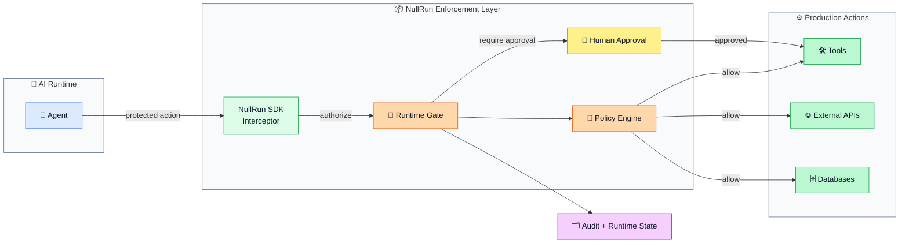
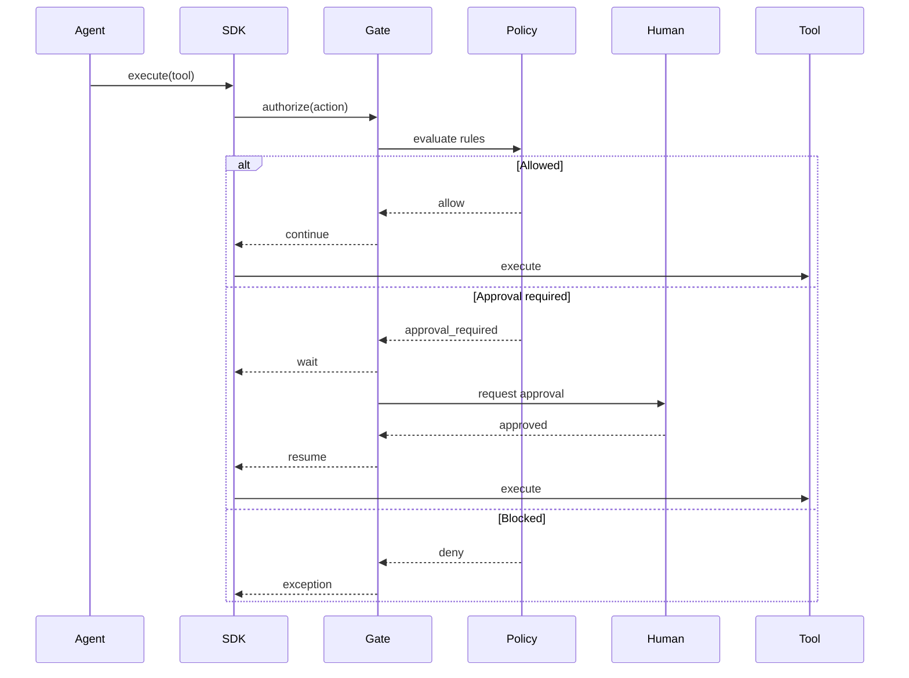

<div align="center">

<!-- HERO -->


# NullRun

**Ship AI agents with real-time budget, policy, and human-approval gates.**

Zero-refactor cost control, tool policy enforcement, and audit trail for any
LLM-powered agent — works with OpenAI, Anthropic, LangGraph, CrewAI, AutoGen,
LlamaIndex, and your own stack.

[Quickstart](#-quickstart) · [Docs](https://docs.nullrun.io) · [Examples](https://github.com/nullrunio/nullrun-examples)

<!-- BADGES: project health -->
<div align="center">
  <a href="https://pypi.org/project/nullrun/"></a>
  <a href="https://pypi.org/project/nullrun/"></a>
  <a href="./LICENSE"></a>
  <a href="https://pypi.org/project/nullrun/"></a>
</div>

<!-- BADGES: CI + quality -->
<div align="center">
  <a href="https://github.com/nullrunio/nullrun-sdk-python/actions/workflows/ci.yml"></a>
  <a href="https://codecov.io/gh/nullrunio/nullrun-sdk-python"></a>
  <a href="https://github.com/nullrunio/nullrun-sdk-python/stargazers"></a>
  <a href="https://github.com/nullrunio/nullrun-sdk-python/commits/master"></a>
</div>

<!-- BADGES: capability markers -->
<div align="center">
  
  
  
</div>

</div>

---

> ⚠️ **Status: alpha (v0.14.7, protocol v3.31.6).** The public API may shift between minor versions. Pin your dependency and read the [CHANGELOG](https://github.com/nullrunio/nullrun-sdk-python/blob/master/CHANGELOG.md) before upgrading.

---

##  Why NullRun?

AI agents can overspend, call dangerous tools, and act without audit trails. 
Existing observability tools tell you **after** the fact. NullRun enforces **before** the action.

| Without NullRun | With NullRun |
|---|---|
| Agent calls `gpt-4o` 10,000 times → surprise $5,000 invoice | Hard budget cap → SDK blocks at 402 before invocation |
| Agent runs `bash rm -rf /` | Tool policy → SDK blocks at 403 before execution |
| Sensitive action with no human in the loop | Approval flow → SDK pauses and waits for WS `approval_resolved` push |
| Cost & calls scattered across 4 libraries | Single source of truth: per-org, per-workflow, per-execution |
| Runaway SDK loop calling `/gate` without `/track` | Per-reservation rate cap → 402 budget error (see `docs/errors/NR-R001.md`) |

---

##  Features

| | |
|---|---|
|  **Hard & soft budget gates** — atomic Redis-enforced, no client-trust model |  **Tool policy enforcement** — block dangerous tools before execution |
|  **Human-in-the-loop approvals** — pause agent and await `approval_resolved` via WS push |  **Immutable audit trail** — every decision, every tool call, every cent |
|  **Zero-code instrumentation** — `nullrun.init()` patches `httpx` once for any vendor |  **LangGraph, CrewAI, AutoGen, LlamaIndex** — first-class integrations |
|  **Memory-safe streaming** — 16 MiB response body cap (anti-OOM); full body for usage extraction |  **Lightweight** — no LLM-key storage, no proxy required |
|  **Server-authoritative cost** — wire protocol v3.31, server-minted execution IDs |  **MCP support** — expose tools to agents via Model Context Protocol |

---

##  Architecture



The gate is **server-authoritative** — the SDK never trusts client-supplied
cost. Redis is the source of truth for budget and tool-policy state; Postgres
holds the immutable audit log.

---



##  Quickstart

Install:

```bash
pip install nullrun
export NULLRUN_API_KEY="nr_..."   # get one at https://nullrun.io/control-center/api-keys
```

### Option — decorator (3 lines)

```python
from nullrun import protect

@protect
def my_agent(prompt: str) -> str:
    return call_llm(prompt)

```
---

## How NullRun compares

| | **NullRun** | LangChain callbacks | Helicone | Portkey | OpenLLMetry |
|---|---|---|---|---|---|
| **Enforce before execution** | ✅ | ❌ observe-only | ⚠️ async | ⚠️ async | ❌ |
| **Server-authoritative budget** | ✅  | ❌ | ❌ | ❌ | ❌ |
| **Tool-call policy** | ✅ | ❌ | ❌ | ⚠️ limited | ❌ |
| **Human-in-the-loop approvals** | ✅ | ❌ | ❌ | ❌ | ❌ |
| **Zero-code instrumentation** | ✅ | ✅ | ✅ | ✅ | ✅ |
| **Immutable audit trail** | ✅ | ⚠️ | ✅ | ✅ | ✅ |
| **Streaming memory cap (anti-OOM)** | ✅ | ❌ | ⚠️ | ⚠️ | ❌ |
| **MCP support** | ✅ | ⚠️ | ❌ | ❌ | ⚠️ |

> NullRun is the only option that **blocks** expensive or dangerous calls *before* they happen, not just observes them.


---

##  Examples

Runnable, copy-pastable examples live in a separate repo so you can adapt without cloning the SDK source:

-  **LangGraph** — multi-node agent with budget + approval [→](https://github.com/nullrunio/nullrun-examples/tree/main/langgraph)
-  **CrewAI** — multi-agent crew with shared budget [→](https://github.com/nullrunio/nullrun-examples/tree/main/crewai)
-  **AutoGen** — group-chat agent with policy gating [→](https://github.com/nullrunio/nullrun-examples/tree/main/autogen)
-  **LlamaIndex** — RAG pipeline with cost-per-query enforcement [→](https://github.com/nullrunio/nullrun-examples/tree/main/llama-index)
-  **Custom tools** — register your own tools for policy [→](https://github.com/nullrunio/nullrun-examples/tree/main/custom-tools)
-  **Multi-agent** — shared budget across sub-agents [→](https://github.com/nullrunio/nullrun-examples/tree/main/multi-agent)

---

##  Roadmap

| Version | Status | Highlights |
|---|---|---|
| **v0.14.x** (current) | ✅ alpha | Wire protocol v3.31, server-minted execution IDs, MCP, anti-OOM streaming cap |
| **v0.15** | 🚧 in progress | OpenTelemetry exporter, Redis-backed offline queue, hardened init contract |
| **v0.16** | 📋 planned | Cost prediction from prompt, semantic tool policy (regex → AST) |
| **v1.0** | 🎯 beta target | Stable wire contract, full async support, type-safe decisions |

[Full roadmap & RFCs →](https://docs.nullrun.io/roadmap)

---

## Development setup

```bash
git clone https://github.com/nullrunio/nullrun-sdk-python
cd nullrun-sdk-python
python -m venv .venv && source .venv/bin/activate
pip install -e ".[dev]"
pytest -q
```

We follow [Conventional Commits](https://www.conventionalcommits.org/),
require tests for new public API, and run `ruff` + `mypy` in CI.

---

## Security

NullRun does **not** store or proxy your LLM provider keys — it sits beside your existing clients and observes the calls. The gate is **server-authoritative** for cost: even a malicious SDK cannot inflate spend by sending a fake `cost_cents` to `/track`.

See the security policy at <https://github.com/nullrunio/nullrun-sdk-python/security/policy> for the threat model and disclosure policy.

To report a vulnerability: **support@nullrun.io**.

---

## Community & support

-  **GitHub Issues**: <https://github.com/nullrunio/nullrun-sdk-python/issues>
-  **GitHub Discussions**: <https://github.com/nullrunio/nullrun-sdk-python/discussions>
-  **Enterprise support**: support@nullrun.io

---

---

<div align="center">

Made with care by [NullRun](https://nullrun.io) and contributors.

[⭐ Star us on GitHub](https://github.com/nullrunio/nullrun-sdk-python) · [📖 Read the docs](https://docs.nullrun.io)

</div>
